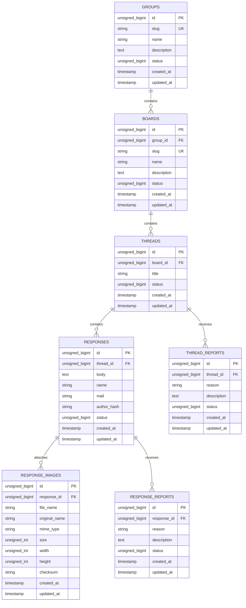

# 5ch風掲示板 API 仕様案

Laravelで実装する、匿名投稿を基本とした5ch風掲示板APIの仕様案です。
本書ではAPIの外部仕様と、実装時のクラス構成を定義します。

## 1. 方針

- APIのベースURLは `/api/v1` とする
- 掲示板、スレッド、レスの取得は公開する
- 投稿者は表示名を持たず、レス番号と投稿時に発行する識別子で扱う
- 書き込みAPIはレート制限を適用する
- 管理操作以外では、投稿者の個人情報をレス本文と同じレスポンスに含めない
- 主キー・外部キーは基本的に unsigned integer を採用し、負の値を持たない連番IDを使う
- UUID を採用する場合は文字列型に切り替え、unsigned は適用しない
- 1ファイル1APIとし、コントローラーはすべてinvokableにする
- コントローラーの公開メソッドは `__invoke` のみとする

## 2. ディレクトリ構成案

```text
app/
├── Http/
│   ├── Controllers/Api/V1/
│   │   ├── GroupListController.php
│   │   ├── BoardListController.php
│   │   ├── ThreadListController.php
│   │   ├── ThreadPostController.php
│   │   ├── PostListController.php
│   │   ├── PostImage/StoreController.php
│   │   └── Post/ReportController.php
│   ├── Requests/Api/V1/
│   │   ├── StoreThreadRequest.php
│   │   └── StorePostRequest.php
│   └── Resources/Api/V1/
│       ├── BoardResource.php
│       ├── ThreadResource.php
│       ├── PostResource.php
│       └── PostImageResource.php
└── Models/
    ├── Board.php
    ├── Thread.php
    ├── Post.php
    └── PostReport.php
routes/
└── api.php
```

ファイル名はAPIの責務単位で分けます。同じコントローラーに複数のAPIを詰め込まず、ルートから処理クラスを直接指定します。

## 3. ルーティング

### APIルートの有効化

Laravel 13では、`bootstrap/app.php` の `withRouting` に `api` を指定して `routes/api.php` を読み込みます。

```php
->withRouting(
  web: __DIR__.'/../routes/web.php',
  api: __DIR__.'/../routes/api.php',
  commands: __DIR__.'/../routes/console.php',
  health: '/up',
)
```

`api` を指定すると、`routes/api.php` のルートには `/api` プレフィックスとAPI用ミドルウェアが適用されます。本仕様では、さらに `/v1` をルートグループへ付けてバージョンを管理します。

### `routes/api.php`

各ルートはinvokableコントローラーを直接指定します。読み取りAPIと書き込みAPIでミドルウェアを分け、スレッド配下のレスはスコープ付きモデルバインディングで解決します。

```php
<?php

use App\Http\Controllers\Api\V1\Board\IndexController as BoardIndexController;
use App\Http\Controllers\Api\V1\Post\ReportController as PostReportController;
use App\Http\Controllers\Api\V1\Post\StoreController as PostStoreController;
use App\Http\Controllers\Api\V1\Thread\IndexController as ThreadIndexController;
use App\Http\Controllers\Api\V1\Thread\ShowController as ThreadShowController;
use App\Http\Controllers\Api\V1\Thread\StoreController as ThreadStoreController;
use Illuminate\Support\Facades\Route;

Route::prefix('v1')->name('api.v1.')->group(function (): void {
  Route::get('/boards', BoardIndexController::class)
    ->name('boards.index');

  Route::get('/boards/{board}/threads', ThreadIndexController::class)
    ->name('boards.threads.index');

  Route::get('/threads/{thread}', ThreadShowController::class)
    ->name('threads.show');

  Route::middleware('throttle:posting')->group(function (): void {
    Route::post('/threads', ThreadStoreController::class)
      ->name('threads.store');

    Route::scopeBindings()->group(function (): void {
      Route::post('/threads/{thread}/posts', PostStoreController::class)
        ->name('threads.posts.store');
    });

    Route::post('/posts/{post}/reports', PostReportController::class)
      ->name('posts.reports.store');
  });
});
```

この定義で、たとえば `Route::post('/threads/{thread}/posts', ...)` は `/api/v1/threads/{thread}/posts` として公開されます。ルート名はテストやURL生成で使用します。

### ルートパラメーター

- `{board}`: `Board`モデルへバインディングする
- `{thread}`: `Thread`モデルへバインディングする
- `{post}`: `Post`モデルへバインディングする
- `/threads/{thread}/posts` のような親子関係では `scopeBindings()` を使用し、対象スレッドに属さないレスを受け付けない
- 対象が存在しない場合はLaravelのモデルバインディングにより `404 Not Found` を返す

### レート制限

`posting` という名前付きLimiterを `AppServiceProvider` などで定義し、IPアドレスと投稿元ハッシュを考慮して書き込みを制限します。制限超過時は `429 Too Many Requests` を返します。

```php
RateLimiter::for('posting', function (Request $request): Limit {
  return Limit::perMinute(10)->by(
    $request->ip().'|'.$request->header('X-Author-Hash')
  );
});
```

実際の制限値や識別子の生成方法は、運用環境と匿名性要件に合わせて決定します。

## 4. API一覧

| No. | メソッド | パス | 内容 | 認証 | クラス |
|---:|---|---|---|---|---|
| 1 | `GET` | `/api/v1/groups` | 掲示板グループ一覧を取得 | 不要 | `GroupListController` |
| 2 | `GET` | `/api/v1/{group_slug}/boards` | 掲示板一覧を取得 | 不要 | `BoardListController` |
| 3 | `GET` | `/api/v1/boards/{board_slug}/threads` | スレッド一覧を取得 | 不要 | `ThreadListController` |
| 4 | `POST` | `/api/v1/board/{board_slug}/threads/create` | スレッドと最初のレスを作成 | レート制限 | `ThreadCreateController` |
| 3 | `GET` | `/api/v1/{thread_id}/thread/responsed` | スレッド一覧を取得 | 不要 | `ThreadListController` |


| 4 | `GET` | `/api/v1/threads/{thread_id}` | スレッドとレスを取得 | 不要 | `Thread\ShowController` |
| 5 | `POST` | `/api/v1/threads/` | スレッドと最初のレスを作成 | レート制限 | `Thread\StoreController` |
| 6 | `POST` | `/api/v1/threads/{thread}/posts` | レスを投稿 | レート制限 | `Post\StoreController` |
| 7 | `POST` | `/api/v1/posts/{post}/images` | 既存レスに画像を追加 | レート制限 | `PostImage\StoreController` |
| 8 | `POST` | `/api/v1/posts/{post}/reports` | レスを通報 | レート制限 | `Post\ReportController` |

パス内の `{board}`、`{thread}`、`{post}` はLaravelのルートモデルバインディングで解決します。認証が必要な管理APIは別途 `/api/v1/admin` 配下に追加します。

## 5. エンドポイント

### 掲示板

#### `GET /api/v1/boards`

掲示板一覧を取得します。

レスポンス例:

```json
{
  "data": [
    {
      "id": 1,
      "slug": "news",
      "name": "ニュース",
      "description": "ニュース全般",
      "thread_count": 42
    }
  ]
}
```

### スレッド一覧

#### `GET /api/v1/boards/{board}/threads`

掲示板内のスレッドを取得します。最終投稿日時の降順で返し、dat落ちしたスレッドは既定では除外します。

クエリパラメーター:

| パラメーター | 型 | 必須 | 説明 |
|---|---|---:|---|
| `page` | integer | 任意 | ページ番号。既定値は1 |
| `per_page` | integer | 任意 | 1〜100。既定値は50 |
| `include_archived` | boolean | 任意 | dat落ちを含める。管理者のみ |

### スレッド詳細

#### `GET /api/v1/threads/{thread}`

スレッド情報とレス一覧を取得します。レスは番号順で返します。

クエリパラメーター:

| パラメーター | 型 | 必須 | 説明 |
|---|---|---:|---|
| `page` | integer | 任意 | レスのページ番号 |
| `per_page` | integer | 任意 | 1〜100。既定値は100 |
| `from` | integer | 任意 | 指定したレス番号以降のみ取得 |

レスポンス例:

```json
{
  "data": {
    "id": 10,
    "board_id": 1,
    "title": "サンプルスレッド",
    "post_count": 12,
    "is_archived": false,
    "created_at": "2026-08-23T12:00:00Z",
    "last_posted_at": "2026-08-23T12:30:00Z",
    "posts": {
      "data": [
        {
          "number": 1,
          "body": "本文です",
          "author_id": "匿名",
          "posted_at": "2026-08-23T12:01:00Z"
        }
      ]
    }
  }
}
```

### スレッド作成

#### `POST /api/v1/threads`

新しいスレッドを作成し、最初のレスも同時に登録します。

リクエスト例:

```json
{
  "board_id": 1,
  "title": "サンプルスレッド",
  "body": "最初の投稿本文です"
}
```

バリデーション:

- `board_id`: 必須、存在する掲示板のID
- `title`: 必須、1〜100文字。不正な制御文字を除外
- `body`: 必須、1〜4000文字
- 同一投稿元からの連続投稿はレート制限する

成功時は `201 Created` と作成されたスレッドを返します。

### レス投稿

#### `POST /api/v1/threads/{thread}/posts`

既存スレッドへレスを投稿します。

リクエスト例:

```json
{
  "body": "レス本文です",
  "name": "名無しさん",
  "mail": "sage"
}
```

画像を添付する場合は `multipart/form-data` を使用し、画像ファイルを `images[]` として送信します。1回の投稿に添付できる枚数は最大5枚、1枚あたりのサイズは最大10MBとします。

```text
body=レス本文です
name=名無しさん
mail=sage
images[]=(image/jpeg)
images[]=(image/png)
```

バリデーション:

- `body`: 必須、1〜4000文字
- `name`: 任意、0〜40文字。未指定時は `名無しさん`
- `mail`: 任意、0〜254文字。保存時は暗号化またはハッシュ化し、通常レスポンスには含めない
- `images`: 任意、最大5ファイル。JPEG、PNG、GIF、WebPのみ許可
- `images.*`: 1ファイルあたり最大10MB。拡張子ではなく実体のMIMEタイプを検証する
- dat落ち、削除済み、書き込み停止中のスレッドには投稿できない

成功時は `201 Created` と新しいレスを返します。

### 既存レスへの画像追加

#### `POST /api/v1/posts/{post}/images`

既存レスへ画像だけを追加します。リクエスト形式は `multipart/form-data` とし、`images[]` を必須とします。画像の並び順は送信順で保存し、成功時は `201 Created` と追加された画像一覧を返します。

### 画像レスポンス

画像は投稿レスポンスの `images` 配列に含めます。ストレージ内部のパスやバケット名は公開せず、アプリケーション経由のURLを返します。

```json
{
  "id": 101,
  "url": "https://example.test/storage/posts/10/01abc.webp",
  "mime_type": "image/webp",
  "size": 182736,
  "width": 1280,
  "height": 720,
  "sort_order": 1
}
```

### レスの通報

#### `POST /api/v1/posts/{post}/reports`

不適切なレスを通報します。通報者情報は通常のレスデータと分離して保存します。

リクエスト例:

```json
{
  "reason": "spam",
  "description": "広告投稿です"
}
```

`reason` は `spam`、`abuse`、`copyright`、`other` のいずれかとします。

## 6. 共通レスポンス

### 成功

- 一覧: `{ "data": [...], "meta": {...}, "links": {...} }`
- 単体: `{ "data": {...} }`
- 作成: `201 Created`

### エラー

```json
{
  "message": "入力内容を確認してください。",
  "errors": {
    "body": ["本文は必須です。"]
  }
}
```

| HTTPステータス | 用途 |
|---:|---|
| `400` | 不正なリクエスト |
| `401` | 認証が必要 |
| `403` | 権限不足、書き込み停止 |
| `404` | 対象が存在しない |
| `409` | 状態が競合している |
| `422` | バリデーションエラー |
| `429` | レート制限超過 |

LaravelのForm Request、API Resource、標準のJSON例外レスポンスを利用します。

## 7. データモデル案

設計上の基本方針として、`id` 系の主キーと外部キーは `UNSIGNED` の整数型を使う。これにより、負数を防ぎ、連番IDのサイズや比較を安全に扱える。なお、UUID を採用する場合は主キー自体を文字列型に切り替える。

### `groups`
- `id` (unsigned bigint)
- `slug`: URL用の一意な文字列
- `name`
- `description`
- `status`: あぼーんなど
- `created_at`, `updated_at`

### `boards`

- `id` (unsigned bigint)
- `group_id` (unsigned bigint)
- `slug`: URL用の一意な文字列
- `name`
- `name_nns`: 名無しさんのデフォルト名 
- `description`
- `created_at`, `updated_at`

### `threads`

- `id` (unsigned bigint)
- `board_id` (unsigned bigint)
- `title`
- `status`: あぼーんなど
- `created_at`, `updated_at`

### `thread_reports`

- `id` (unsigned bigint)
- `response_id` (unsigned bigint)
- `reason`
- `description`
- `status`: 受理など
- `created_at`, `updated_at`


### `responses`

- `id` (unsigned bigint)
- `thread_id` (unsigned bigint)
- `body`
- `name`
- `mail`
- `author_hash`: 投稿元を識別するためのローテーション可能なハッシュ
- `status`: あぼーんなど
- `posted_at`
- `created_at`, `updated_at`

### `response_images`

- `id` (unsigned bigint)
- `response_id` (unsigned bigint)
- `original_name`: 投稿時のファイル名
- `file_name`: 保存時のファイル名
- `mime_type`
- `size` (unsigned bigint): バイト単位
- `width` (unsigned bigint), `height` (unsigned bigint): 画像サイズ。取得できない場合はNULL
- `status`: あぼーんなど
- `created_at`, `updated_at`

### `response_reports`

- `id` (unsigned bigint)
- `response_id` (unsigned bigint)
- `reason`
- `description`
- `status`: 受理など
- `created_at`, `updated_at`

### ER図

実装上は `id`、`board_id`、`thread_id`、`post_id` などの連番は `UNSIGNED` で扱う。`number` や `sort_order` のような順位情報も負数を持たないため、同様に `UNSIGNED` を基本とする。



制約:

- `boards.group_id` に外部キーを設定する
- `threads.board_id` に外部キーを設定する
- `responses.thread_id` に外部キーを設定する
- `response_images.response_id` に外部キーを設定する
- `response_reports.response_id` に外部キーを設定する

### オブジェクトストレージ

画像の実体はS3互換のオブジェクトストレージへ保存し、`post_images` にはメタデータとオブジェクトキーだけを保存します。

- 本番: Amazon S3などのS3互換ストレージ
- ローカル開発: MinIO
- LaravelのFilesystemでは `s3` ドライバーを使用し、環境変数で接続先を切り替える
- オブジェクトキーは `posts/{post_id}/{uuid}.{extension}` のように生成する
- DB保存とオブジェクト保存はトランザクションだけでは一括管理できないため、失敗時の孤立ファイル削除を実装する
- 削除時はDBレコードだけでなく、対応するオブジェクトも削除する

環境変数の例:

```dotenv
FILESYSTEM_DISK=s3
AWS_ACCESS_KEY_ID=minioadmin
AWS_SECRET_ACCESS_KEY=minioadmin
AWS_DEFAULT_REGION=us-east-1
AWS_BUCKET=board-images
AWS_ENDPOINT=http://minio:9000
AWS_USE_PATH_STYLE_ENDPOINT=true
```

## 8. 認証・セキュリティ

- 閲覧APIは匿名アクセス可能とする
- 管理APIを追加する場合はLaravel Sanctum等で認証する
- 書き込みAPIにはIP単位・投稿元ハッシュ単位のレート制限を設定する
- 本文はHTMLとして解釈せず、表示側でエスケープする
- URLを許可する場合も、危険なスキームや大量リンクを検査する
- `mail`、IPアドレス、User-Agentは管理用途以外のレスポンスに含めない
- 通報APIには連続送信対策を設定する
- 画像は拡張子ではなく実体のMIMEタイプと画像デコーダーで検証する
- 画像の保存先バケットは公開設定にせず、署名付きURLまたはアプリケーション経由で配信する
- 画像のピクセル数、縦横比、アニメーションGIFなどの扱いを制限する
- 画像処理ライブラリで再エンコードし、アップロードされたメタデータをそのまま信頼しない

## 9. 実装ルール

各APIクラスは1つのユースケースだけを担当します。

```php
final class StoreController
{
    public function __invoke(StorePostRequest $request, Thread $thread): JsonResponse
    {
        // 投稿処理
    }
}
```

- 処理が複雑になった場合は、ドメインサービスやアクションクラスへ移す
- トランザクション内でレス番号の採番、レス保存、スレッド集計値更新を行う
- モデルの直接公開を避け、Resourceで返却項目を固定する
- ルートモデルバインディングで対象の存在確認を行う
- `routes/api.php` を利用するため、`bootstrap/app.php` のルーティング設定にAPIルートを追加する

## 10. テスト案

Feature Testを中心に、次を確認します。

- 掲示板一覧とスレッド一覧を取得できる
- スレッド作成時に最初のレスが番号1で作成される
- レス投稿で番号が重複しない
- dat落ち・ロック済みスレッドへの投稿が拒否される
- 不正な本文、長すぎるタイトル、存在しない掲示板が拒否される
- レート制限超過時に `429` が返る
- 通常レスポンスにメールアドレスやIPアドレスが含まれない
- `multipart/form-data` で画像を添付でき、`post_images` にメタデータが保存される
- 許可されていないMIMEタイプ、サイズ超過、枚数超過の画像が拒否される
- 画像保存に失敗した場合にDBレコードやオブジェクトが不整合にならない
- 画像URLにストレージ内部の認証情報やバケット情報が漏れない
- 通報が重複・大量送信されない

## 11. 実装フェーズ案

1. マイグレーション、モデル、Factoryを作成
2. `routes/api.php` とAPIルート設定を追加
3. 掲示板・スレッド・レスの読み取りAPIを実装
4. スレッド作成・レス投稿と画像アップロードを実装
5. S3/MinIO接続、画像検証、孤立ファイル削除を実装
6. レート制限、通報、削除・管理機能を実装
7. Feature TestとOpenAPIドキュメントを追加
